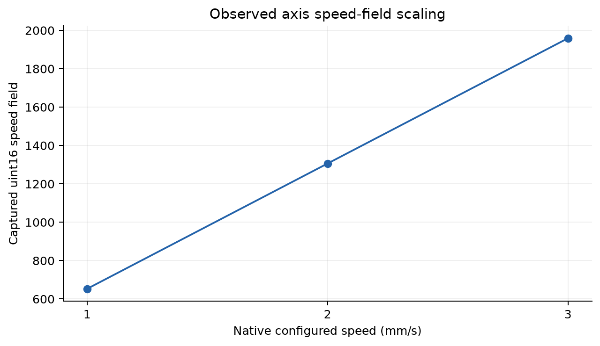
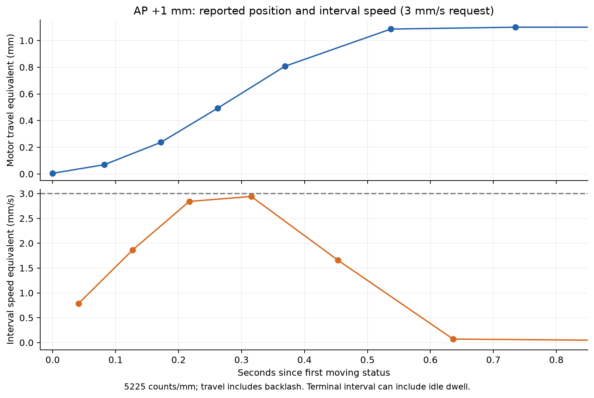
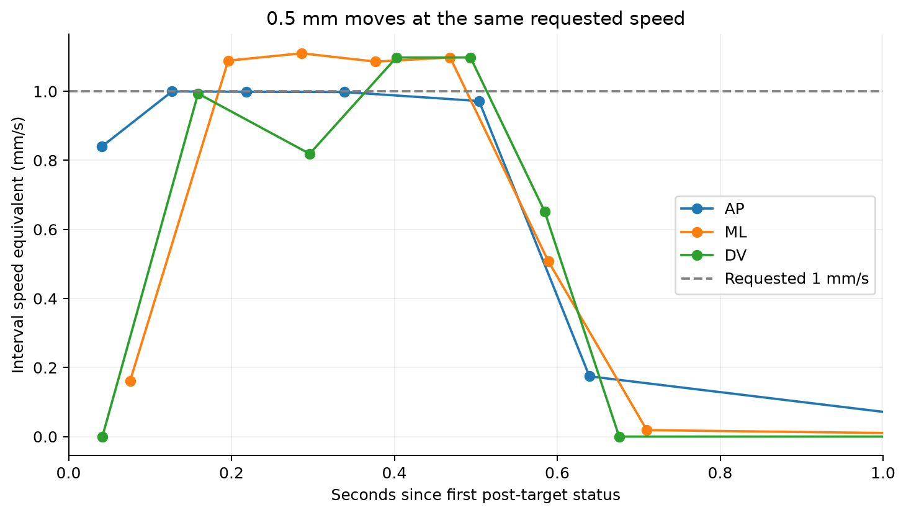
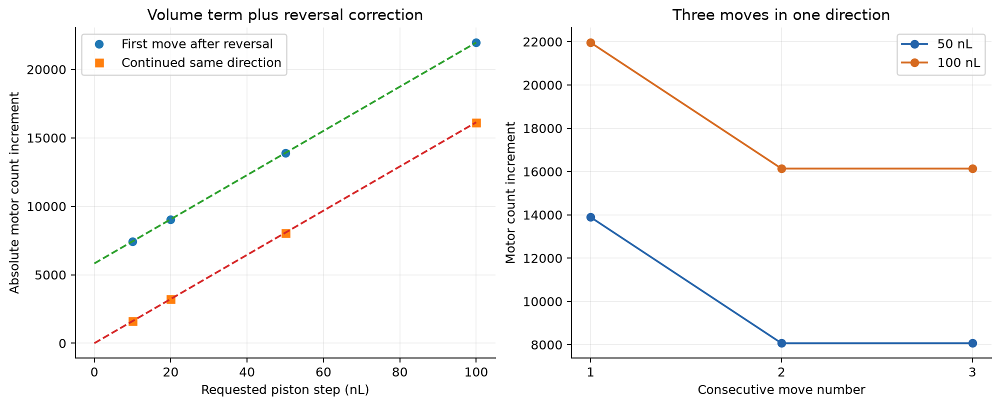
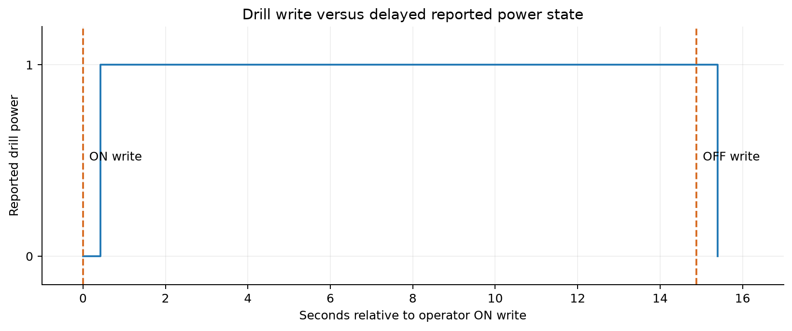

# StereoDrive / Injectomate USB investigation

Report date: 10 October 2026 (Europe/Madrid). Evidence: supervised bench captures
from 9–10 October; 87 scoped files in [data/](data/README.md). This report describes
the final understanding, correcting earlier single-point estimates. The new API
and its GUI integration have simulator validation, not a complete new hardware
acceptance test. The operator separately reported successful movements with the
earlier standalone direct USB GUI.

## Experimental method and evidence limits

The native StereoDrive application was exercised through a local bounded GUI
probe while USBPcap captured hub 2, devices 3 and 7. Experiments changed one axis,
distance, direction or setting at a time, with explicit returns after successful
arrival. Later piston experiments required independently recorded motor idle at
the target before any reverse leg. Drill ON/OFF was operated by the human, not
replayed by the agent. All experiments were supervised, with a clear bench and
physical Stop available; piston tests used verified setup and safe fluid collection.

The archived files are filtered copies limited to that device scope. Original and
archive SHA-256 values, UTC range, target packets, native requests/results where
available, final observed counts and findings accompany each capture. Failed,
passive and incomplete captures are retained. Archive packet numbering can differ
from earlier source reports after filtering; UTC and payload identify the event.
Some early native command bodies were not retained: exact captured target bytes
remain evidence, while intended physical units are not reconstructed from names alone.

Feedback is controller-reported raw motor count and moving state. No independent
encoder, displacement instrument, delivered-volume measurement or RPM sensor was
used in these captures. Therefore a reported arrival cannot exclude missed physical
steps, mechanical slip, collision, leakage or fluid-volume error.

## Device identity and ownership

Movement, piston and drill-correlated traffic used VID 0483 / PID 5743, USB serial
206334AC5031, then COM4 / bus 2 address 3. Bulk OUT endpoint was 0x01 and IN 0x81.
The other scoped device was VID 0483 / PID 5741, then COM3 / address 7; it did not
carry the active commands in the later syringe experiments. COM ports and USB
addresses are session-specific. The API identifies the fixed serial identity via
the Windows registry and opens its current COM port exclusively. It preserves the
driver's current serial configuration rather than guessing baud or toggling DTR.
StereoDrive and its automation must be closed before direct API connection.

## Packet layouts established by isolated experiments

All offsets below are zero-based. No separate checksum was identified for these
captured packets; this is not a claim about every command or firmware family.

| Packet | Observed role |
|---|---|
| OUT `AF 0C selector ...`, 17 bytes | Absolute motor target plus motion profile |
| OUT `AF 0E selector` | Position/motion query |
| OUT `AF 0F selector` | Per-channel Stop |
| IN `0C ...`, 9 bytes | Target acknowledgement, not arrival |
| IN `0E ...` | Reported raw count, clock and motion byte |
| OUT `AF 11 01` / `AF 11 00` | Drill ON / OFF writes in operator capture |
| OUT `AF 12`; IN `12 state ...`, 14 bytes | Drill reported power query/reply |
| OUT `AF 45 00` and `AF 53` | Recurring auxiliary queries; remaining semantics opaque |

Target offsets: bytes 0–2 are AF, 0C and selector; 3–6 signed int32 little-endian
target; 7–8, 9–10 and 11–12 three little-endian uint16 profile fields; 13–16 four
profile/flag bytes. Selectors are AP 0x40, ML 0x50, DV 0x60, piston 0x70.
The first profile word follows the native axis speed setting. The two subsequent
words were 8000 throughout these experiments; their exact physical interpretation
(acceleration, limits or another parameter) was not established.

Status bytes: 0 is 0E; 1–4 device clock, with elapsed values consistent with
milliseconds; 5 selector; 6–9 signed raw count; 10 motion flag (1 moving, 0 idle in
observed replies). AP replies were 21 bytes, ML/DV/piston 26 bytes. Tail fields
remain opaque. AP acknowledgement fields matched prior raw and requested raw;
ML, DV and piston instead matched prior raw twice. Arrival verification therefore
uses later status at the target and idle, not the acknowledgement's second field.

A movement is one absolute target command, followed by polls. The controller
internally generates motor steps; the host does not send a command for each tick.
While moving, relevant position polling was commonly around 90 ms (~11 Hz), with
longer intervals and duplicate/held count values in some captures. Idle native
polling was roughly once per channel per 1.2 seconds, interleaved with other queries.
These are observed native schedules, not a guaranteed firmware reporting rate.

## AP / ML / DV position model and backlash

19 completed broad out-and-back trials established 38 arrival legs across all
three axes, including positive 0.1, 0.2, 0.5 and 1 mm moves, and negative 0.1 and
1 mm moves. The series returned to native mechanical Axis AP 42.75, ML 39.47,
DV 32.01 mm. Earlier small trials covered 0.01, 0.02 and 0.05 mm. All successful
claims require the appropriate completed trace, not a similarly named failed one.

| Channel | Raw sign for increasing coordinate | Approximate scale | Backlash state at positive raw direction |
|---|---:|---:|---:|
| AP | -1 | 5225 counts/mm | 522 counts (~0.10 mm) |
| ML | +1 | 5225 counts/mm | 261 counts (~0.05 mm) |
| DV | -1 | 5225 counts/mm | 52 counts (~0.01 mm) |
| Piston | +1 for native up | 161.36 counts/nL | 5825 counts (~36.10 nL equivalent) |

For normal coordinate count N, the commanded raw target is `round(N + B)`.
B is the maximum backlash state after a positive raw-direction move, or zero
following a negative raw-direction move. On reversal, the change in B adds a
fixed correction; repeated movement in the same direction uses the distance term
alone. The same physical coordinate can therefore have different raw counts.
Backlash differs across axes; that is consistent with different mechanisms and
settings, but the captures do not identify its mechanical cause or prove the
correction is optimal under every load. Rounding introduces roughly one-count
variations. 5225 is the refined approximate scale, replacing the earlier 5220 estimate.

The API keeps fractional normal targets to avoid repeatedly discarding sub-count
remainders. It stores direction/backlash state and refuses stale count/reference
restoration. Counts alone cannot recover unknown direction history or detect missed
physical motor steps.

## Axis speed setting and acceleration/braking evidence

Native configured 3, 2 and 1 mm/s corresponded to speed fields 1959, 1306 and 653:
653 field units per configured mm/s in these observations. AP at 2 mm/s was
captured independently; at 1 mm/s all AP/ML/DV packets used 653 and the native
options dialog confirmed 1.00 mm/s for all three.

The final API defaults to 2 mm/s using the captured field 1306 and mode byte 1.
Optional 1 mm/s uses field 653 and its captured mode byte 2. The byte-14 change
from 1 to 2 was observed, but its meaning is unknown; retaining each observed
profile avoids inventing its semantics. AP/ML direction flag byte 15 was 1 in
both numerical directions; DV flag was 1 for increasing coordinate and 0 for
decreasing coordinate. The piston used its distinct captured profile and flag 0.

Within the original axis-size series from 0.01 to 1 mm the requested profile was
unchanged. No distance-dependent host speed selection was found in those tests.
Effective travel speed can nevertheless differ for short moves because of ramps.

The AP 1 mm/3 mm/s trace gives consecutive interval estimates near 0.78, 1.86,
2.84, 2.94, 1.66 and 0.07 mm/s equivalent. This supports acceleration and braking
around a brief near-requested peak. The raw travel includes backlash, hence about
1.1 mm motor equivalent for this 1 mm coordinate move. Terminal averages can
include time already stationary. Connecting plotted samples is not a fitted
continuous ramp and cannot establish exact acceleration constants.

At the common 1 mm/s request, AP's middle count slope was about 1.00 mm/s
using 5225 counts/mm, while ML/DV samples were often around 1.10 mm/s equivalent.
Held/duplicate counts and variable polling make some intervals irregular. This
discrepancy is retained; it does not prove a physical calibration mismatch, nor
that the axes physically have precisely equal or unequal velocities.

The native Speed dialog also has Auto-Speed and position/function zones. The
observed configuration had Auto-Speed unchecked; AP/ML/DV were 1.00 mm/s. Zone
options showed safety and drill approach heights -5.00 mm above skull, drill
approach 1.00 mm/s, drilling-in 0.05 mm/s and extraction 0.20 mm/s. These are the
operator's observed settings, not recommended universal values. They are keyed
to height/function rather than a movement-length threshold in that dialog. The
direct API does not implement native skull zones or automatic speed selection.

If speed/load causes missed physical steps, the reported counts may still look
correct. A 2 mm/s default is a user-requested profile, not a demonstrated safe
maximum. Validate with an external displacement measurement under real loading,
both directions, including reversals; stop and investigate any discrepancy.

## Injectomate piston results

The native syringe configuration remained Neurostar Nano 5 uL. Initial tests
captured 10 nL up/down, then range tests captured 20, 50 and 100 nL and returns.
Repeated-direction tests included two same-direction steps at 10/20/50/100 nL,
then three same-direction steps at 50 and 100 nL, with three reverse steps.
All later completed sequences returned exactly to original raw count -8572;
final two recorded syringe status samples were idle at each endpoint before the
next leg. AP/ML/DV remained 43.27, 39.99, 31.52 mm during these later syringe tests.

| Requested nL | First step after reversal (counts) | Continued same direction (counts) |
|---|---:|---:|
| 10 | 7438–7439 | 1613–1614 |
| 20 | 9052–9053 | 3227–3228 |
| 50 | 13893–13894 | 8068–8069 |
| 100 | 21961–21962 | 16136–16137 |

The three positive 50 nL moves were 13893, 8068 and 8069 counts; reverse moves
were -13894, -8068 and -8068. Three positive 100 nL moves were 21961, 16137 and
16136; reverse moves were -21961, -16137 and -16136. This supports the fixed
~5825 reversal term plus ~161.36 counts/nL. The first single 10 nL displacement
had initially suggested 743.9 counts/nL; that estimate is superseded because it
included the reversal correction. The table is software calibration evidence,
not proof of actual fluid delivery or optimal compensation.

All tested piston target profiles were `1C 07 40 1F 40 1F 00 01 00 04`:
field words 1820, 8000, 8000 and flags 0,1,0,4, irrespective of step volume or
direction. Field 1820 is not interpreted in axis mm/s units. Larger piston steps
showed middle slopes around 16000 motor counts/s with lower startup/end slopes,
but irregular samples prevent a complete speed/flow model. Controlled injection
with a separately configured Rate was not tested. The new API exposes bounded
free-piston stepping, not a certified volume pump or injection-rate controller.

One early down capture reported native completion while subsequent motor status
still showed motion; the capture ended before verified idle. A later passive
capture confirmed the original count -8572 idle. The initially suspected final
offset was not established. Subsequent tests retained capture observation after
native completion and checked raw endpoint/idle before reversal.

## Drill commands and status

The human operated one ON/OFF cycle. Device 3 received `AF 11 01` and `AF 11 00`.
Native polling used `AF 12`, with 14-byte replies beginning `12 00` for OFF and
`12 01` for ON. Observed reported transitions lagged writes approximately
0.43 and 0.51 seconds. Remaining reply bytes are opaque; power state is not RPM
or proof that the spindle is stationary. Chat ON/OFF messages arrived later and
were not treated as the actual switching timestamps. No motor target commands
were present in this drill capture, and motor counts stayed constant.

The API adds ON/OFF writes and strict reported-state querying with a bounded
transition wait. ON requires explicit enablement, is not retried after uncertainty,
and errors attempt OFF. Stop/close attempt and verify OFF when drill control is
enabled. These new direct methods have simulation validation only; no drill ON
command was sent during API/GUI development.

## Absolute calibration now supported

`Calibration` accepts a count at zero mm for AP, ML and DV, plus a piston count
at 3000 nL. Known backlash at each anchor is subtracted first. Current backlash
is independently tracked from verified direction history. Axes use the signs and
5225 counts/mm above; piston uses 161.36 counts/nL. The resulting absolute
coordinates are those of the supplied anchors, not automatically native Axis or
Bregma coordinates. Without anchors the API uses its persisted relative reference.
Calibration changes interpretation only and does not reset or move the hardware.
Anchor and current backlash histories can differ and must not be conflated.

The position model is `q = (raw - B_current - reference) / (sign * scale)`.
For axis zero, reference is `anchor_count - B_anchor`. For piston,
reference is `anchor_count - B_anchor - 3000 * 161.36`. Supplying the same
calibration is required for saved-state restoration. A changed calibration,
invalid saved state or differing raw counts is rejected rather than silently
resuming with guessed coordinates.

## Software incidents and implementation safeguards

An early native adapter sent BM_CLICK and an additional parent WM_COMMAND,
producing duplicate outward moves. A rounded GUI readout accepted an intermediate
position before the later target finished, so a return timed out. The investigated
fix removed duplicate notification and required stable idle/enabled controls;
subsequent bounded nudge tests succeeded. Separate GoTo trials populated fields
but emitted no target packets; that path was stopped and remains outside this API.

A server controlled-injection implementation set the free-piston volume combo but
did not establish the separate controlled Quantity/Rate fields. Therefore its
API volume argument alone did not prove a bounded controlled injection. That
path was not used for the range investigation and is not exposed here. Piston
steps use the captured motor profile and explicit unit limits.

The new API uses exclusive serial ownership, a serial I/O lock for concurrent
motion queries, strict reply shape/opcode/channel checks, no guessed resynchronizing,
one target per move, and exact raw-target/idle settling for 200 ms. It rejects
busy commands and bounds each axis action to 1 mm, piston action to 100 nL, with
cumulative connection envelopes of +/-1 mm and +/-100 nL respectively. These are
software limits, not a safe collision path. No automatic recovery or reversal.
State is invalidated and atomically flushed before a target; interrupted or faulty
sessions cannot silently restore position/backlash. Simulation and live state are
separate. Stop requires working software/transport; physical Stop remains essential.

The standalone GUI now imports this package rather than its former duplicated
motion engine. It provides axis arrows, step sizes, piston up/down steps, drill
ON/OFF, displayed power/motion state, optional absolute anchor loading and opt-in
DV/injector/drill controls. It starts disconnected in simulation and its desktop
shortcut still launches that separate folder. See the GUI README for setup.

## Reproduction and remaining unknowns

- Run API tests: `py -3 -B -m unittest discover -s stereodrive_api/tests -v`.
- Read [archive manifest](data/manifest.json) and each capture's metadata.
- Rebuild archive with `scripts/build_archive.py --source PATH_TO_SAVED_LOGS`;
  requires TShark and never captures or sends device commands.
- Rebuild figures with `scripts/make_figures.py`; requires matplotlib for report
  generation only. Runtime API requires only Python standard library.

Still unknown: exact scale constants beyond approximate observed values; mechanical
load-dependent missed-step limits; continuous acceleration/braking parameters;
meaning of profile mode and auxiliary/tail fields; native Auto-Speed behavior
when enabled; validated direct drill replay and RPM; controlled injection-rate
mapping; fluid-volume accuracy; physical backlash calibration and reference integrity
across power loss/manual motion. The archive supports the tested bounded behavior,
not arbitrary firmware commands or general clinical use.
